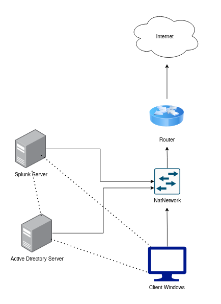

# 🖥️ **ACTIVE DIRECTORY LAB**
Active Directory Lab that sets up a Windows Server Domain Controller and configures DNS integration so domain clients can resolve the domain and authenticate in the environment. 

The lab builds an OU structure with users and groups, then uses Group Policy Objects (GPOs) to enforce and validate policy behavior. All build steps, configurations, and validation tests are documented in this repository.

## 📝 **Lab Goals**
- Install and promote a Windows Server VM to a Domain Controller 
- Design an structure and implement users and security groups to match the lab’s access model
- Create, configure, and link GPOs to specific OUs to apply policy to targeted users/computers
- Validate domain join, authentication, and policy application using test users/computer scenarios
- Troubleshoot common issues and document fixes used during the build

## 🗺️ **Lab Topology**

## 🚙 **Milestones**
## 📍 **Map**
