# 🖱️ **Active Directory VM Setup**

### **1) Setup Virtual Machine**
- Open **Virtual Box**
- Click **New**

- Type VM name in **VM Name**
- Choose iso image in **ISO Image**
- Deselect **Proceed with Unattended Installation**
- Make sure **OS** and **OS Version** are correct

- Right click on created VM and Select **Settings**
- Scroll down to **Network**
- Select **Nat Network** and Select the created Nat Network
- Have **Promiscuous Mode** switched to **allow all**
- Select **OK**

### **2) Installing Windows Server**

- Select **Active Directory VM**
- Click **Next** and **Install Now**
- Select **Standard Desktop Experience**

- Click **Custom Install**
- Click **Next**
- Wait for Restart

- Create Password for Admin Account
- Click **Finish**
- Login to make sure the created password works

### **3) Network Setup**

- Go to search bar and type **Network** and click **Network Status**
- Click **Change Adapter Options** and right click Ethernet and click **Properties**
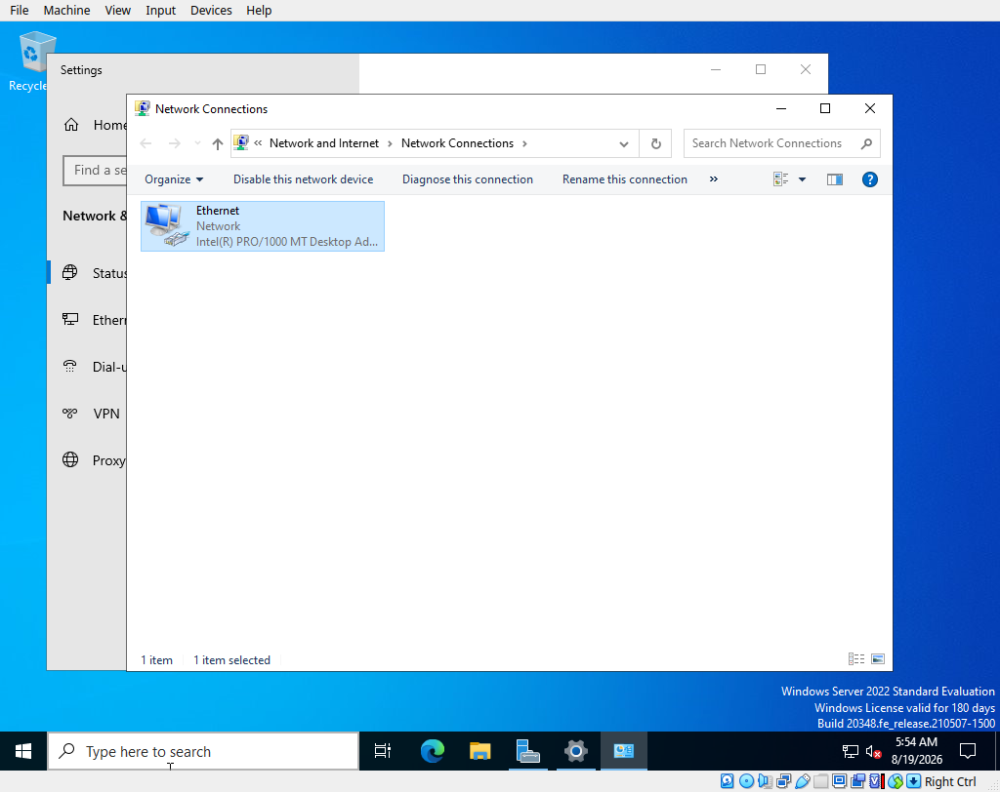

- Select **Internet Protocol Version 4** and click **Properties**
- Setup a Static IP address and DNS IP to localhost 127.0.0.1
- Click **OK**
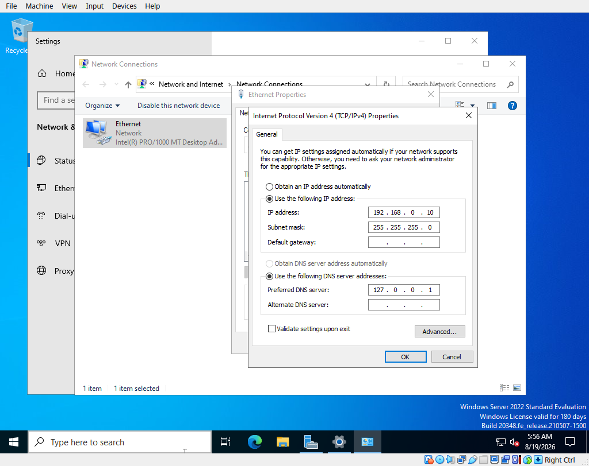

- Go to **Server Manager** and click **Local Server**
- Click **Computer Name**
- Select **Change** and input your new Server Name
- Restart Server
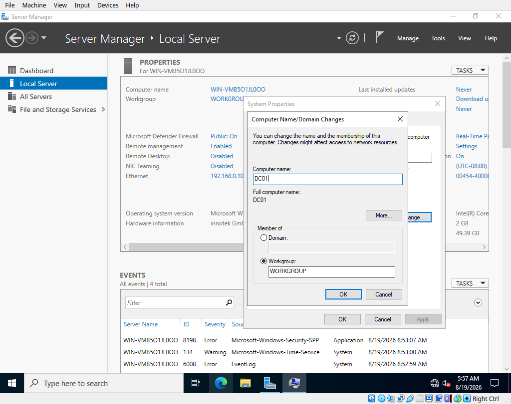

### **4) Active Directory Setup**

- Go to **Server Manager** and go to **Manage** and click **Add Roles and Features**
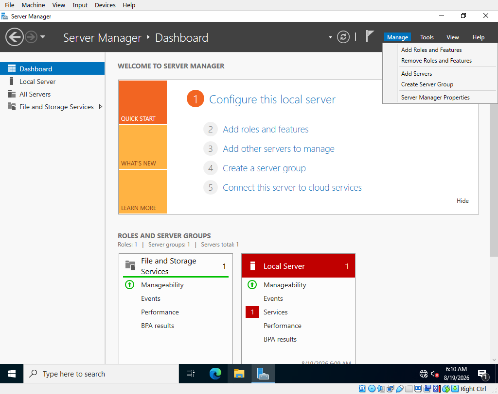

- Click **Next**
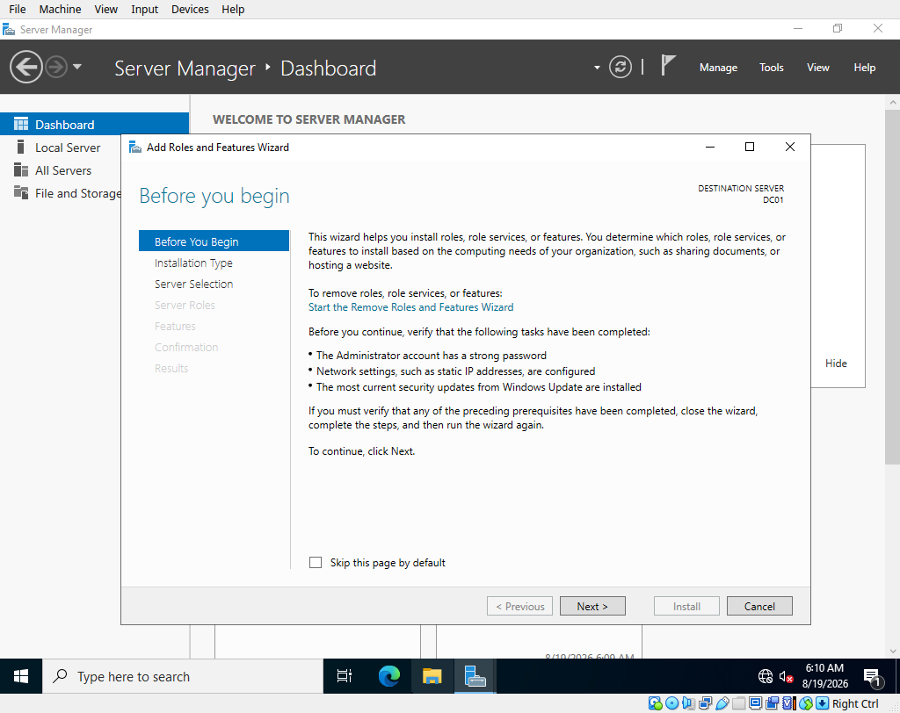

- Select **Active Directory Domain Services**
- Click **Next**
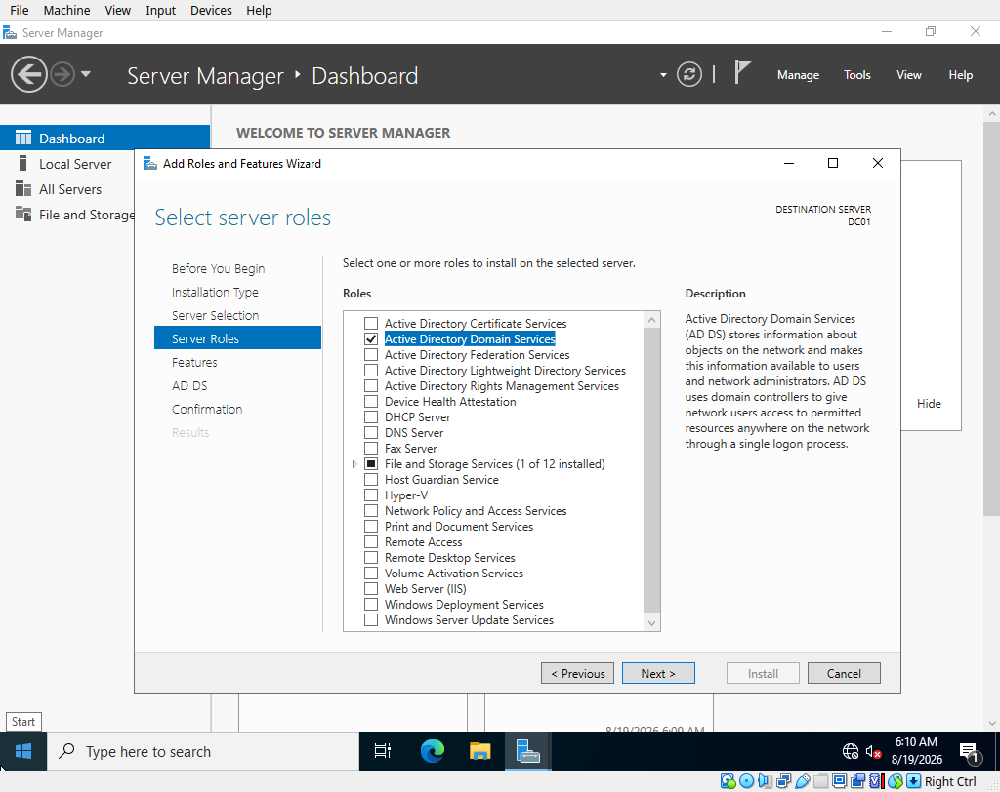

- When you get to Confirmation, click **Install**
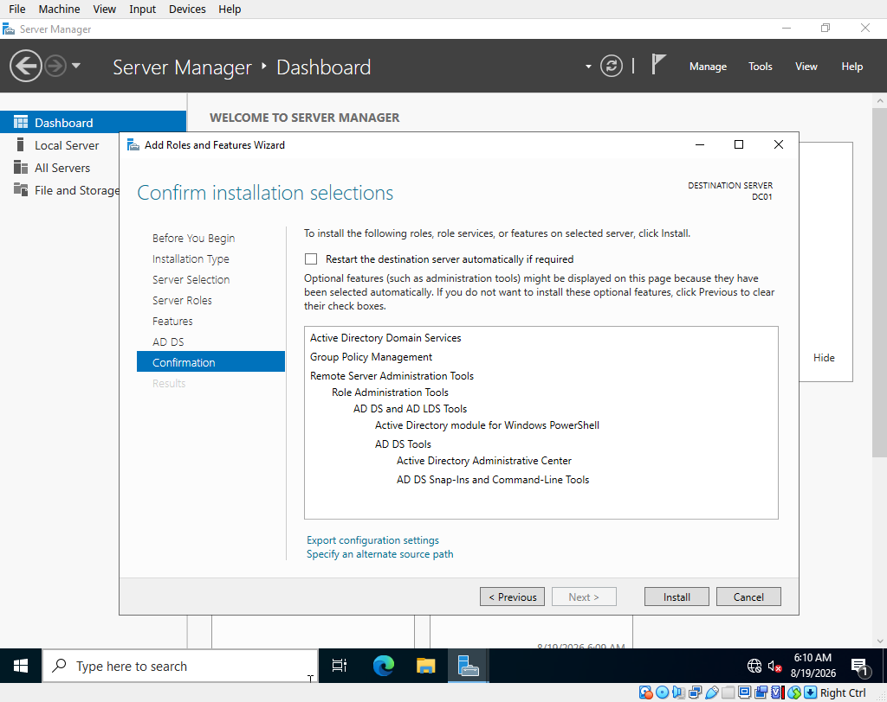

- After Install, Select **Flag with '!'**
- Click **Promote this Server to Domain Controller**
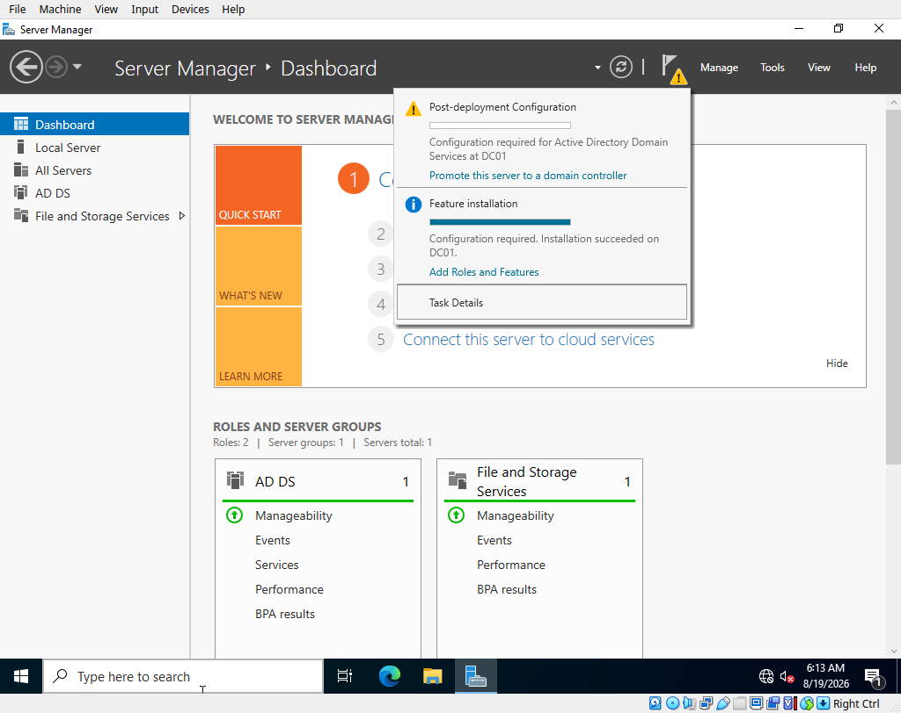

- Select **Add New Forest**
- Create a name for **Root Domain Names**
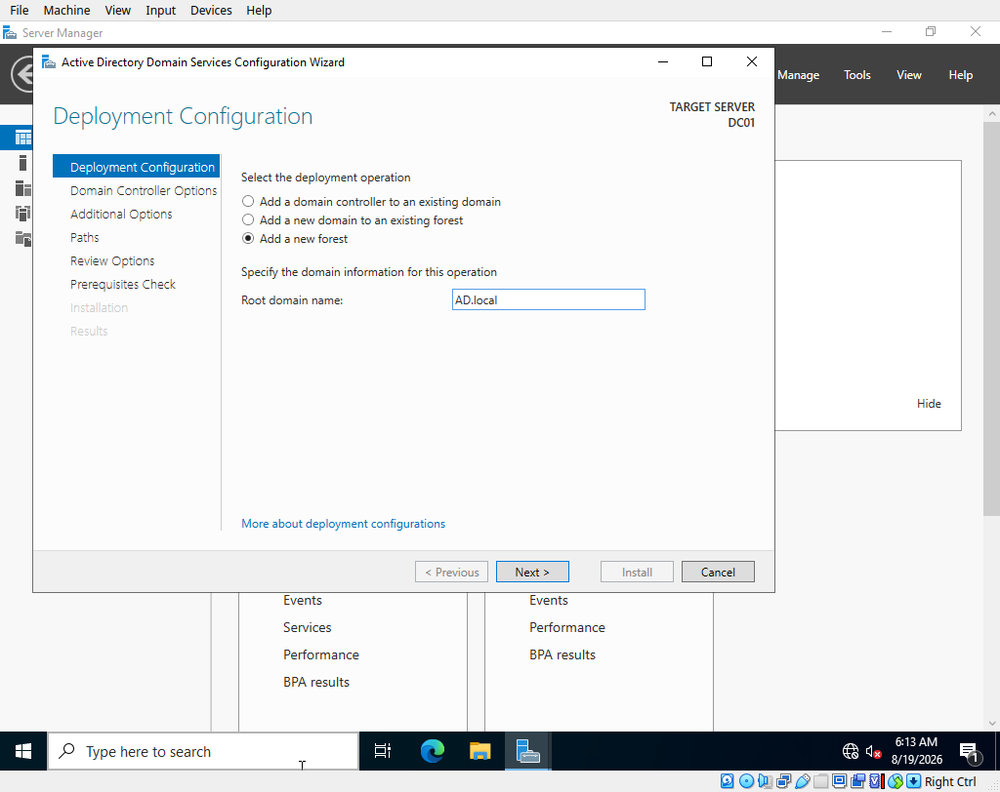

- Click **Next**
- Create and Confirm **Password**
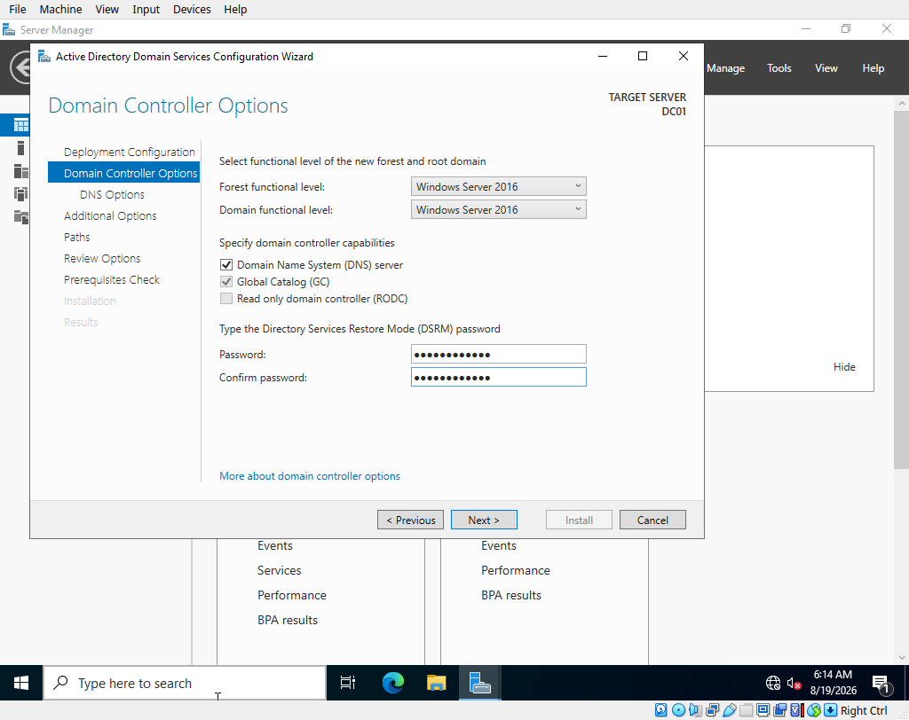

- Click **Next** until **Install Button Appears** and click **Install**
- Restart Server after Install is Completed
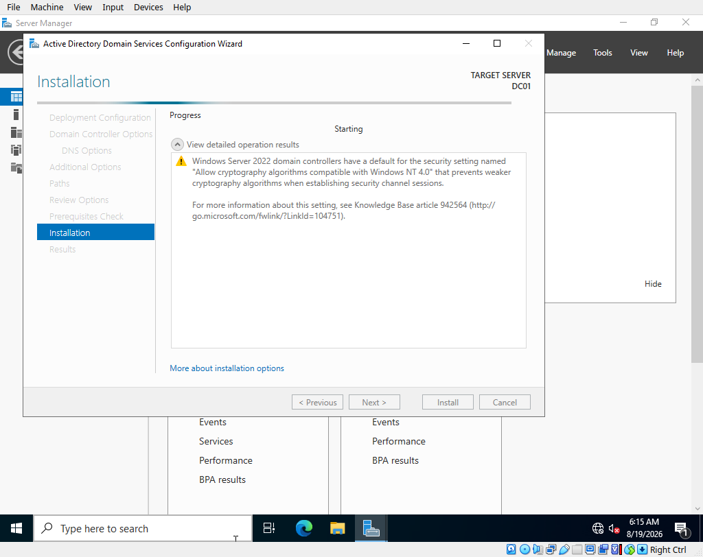
