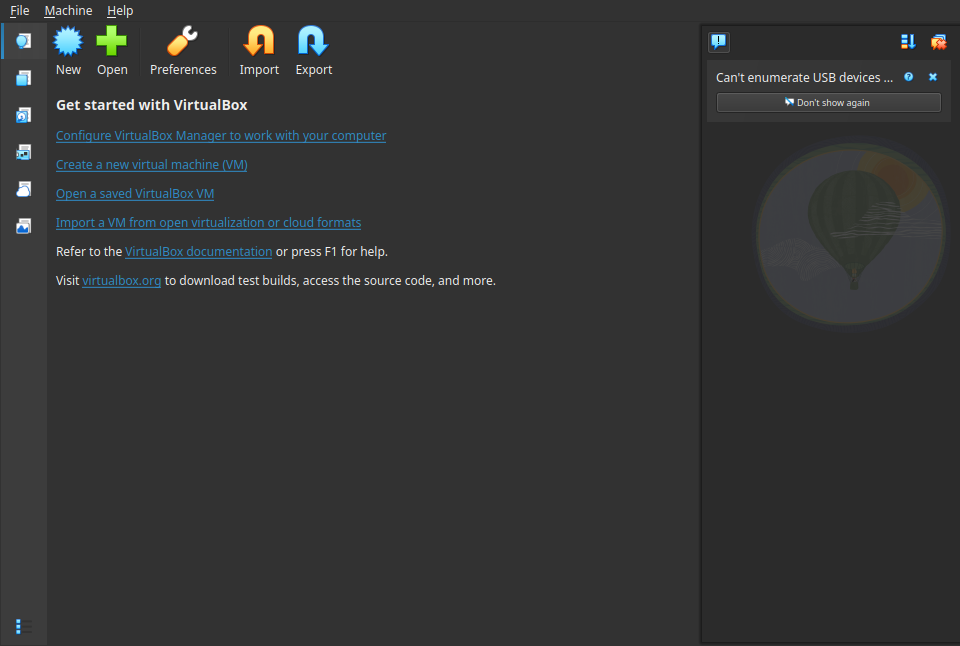
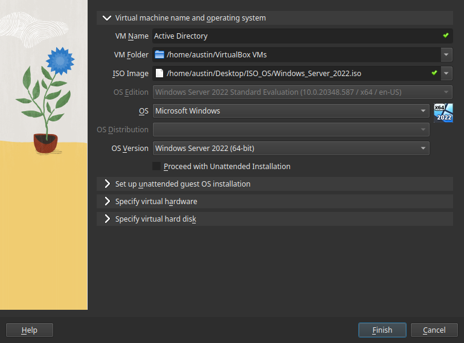
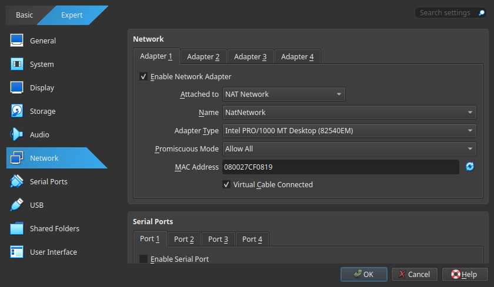
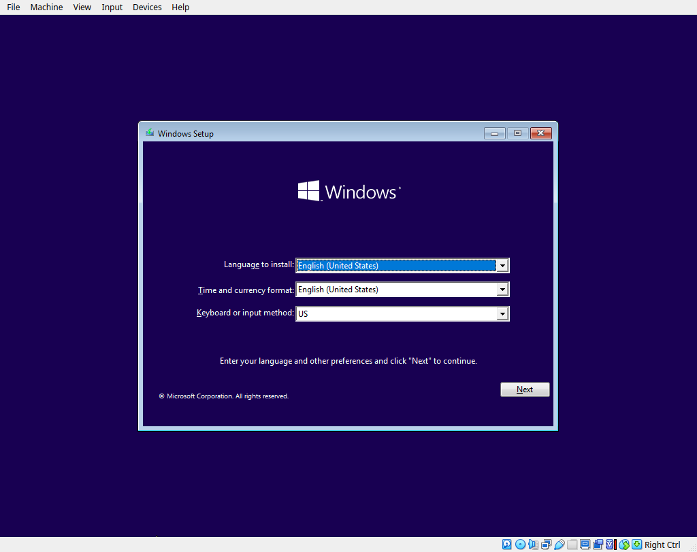
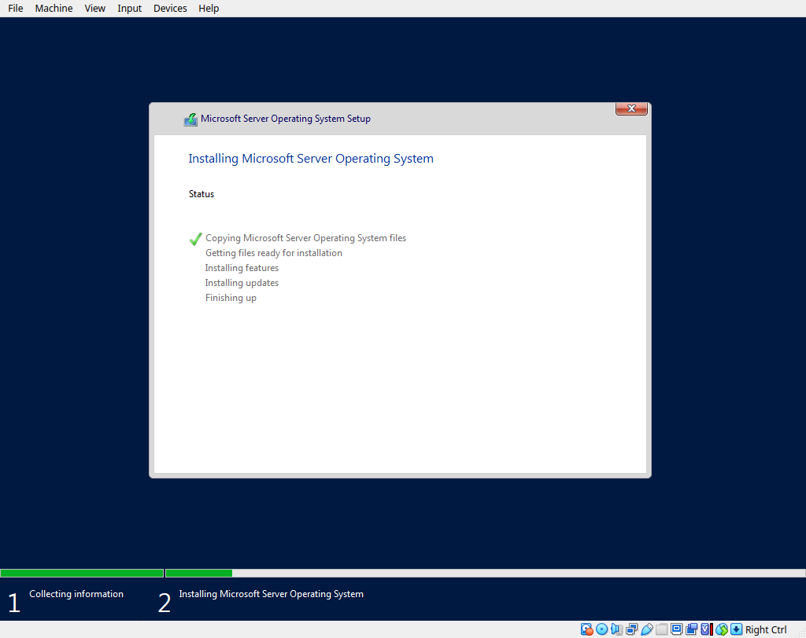
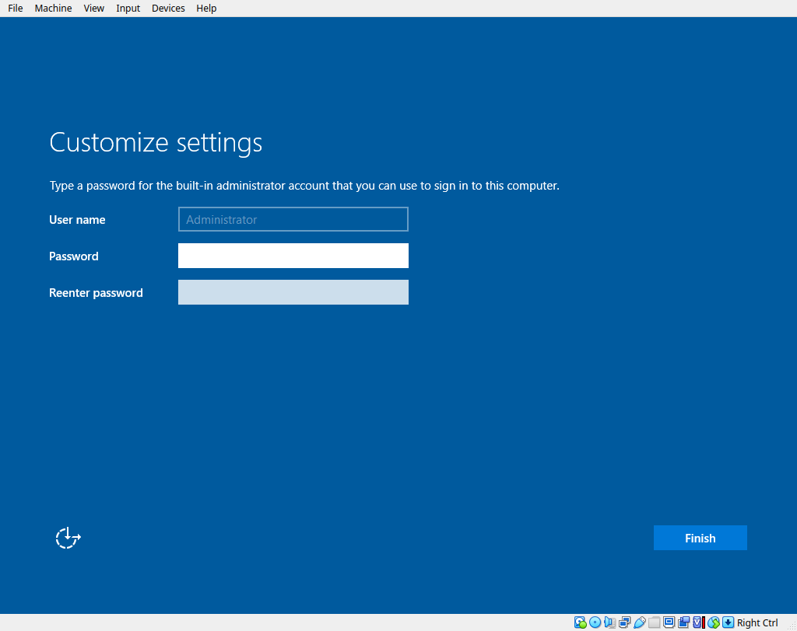

# 🖱️ **Active Directory VM Setup**

### **1) Setup Virtual Machine**
- Open **Virtual Box**
- Click **New**

- Type VM name in **VM Name**
- Choose iso image in **ISO Image**
- Deselect **Proceed with Unattended Installation**
- Make sure **OS** and **OS Version** are correct

- Right click on created VM and Select **Settings**
- Scroll down to **Network**
- Select **Nat Network** and Select the created Nat Network
- Have **Promiscuous Mode** switched to **allow all**
- Select **OK**

### **2) Installing Windows Server**

- Select **Active Directory VM**
- Click **Next** and **Install Now**
- Select **Standard Desktop Experience**

- Click **Custom Install**
- Click **Next**
- Wait for Restart

- Create Password for Admin Account
- Click **Finish**
- Login to make sure the created password works

