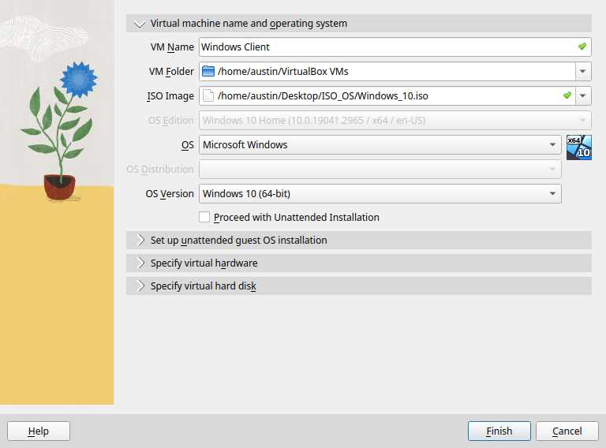
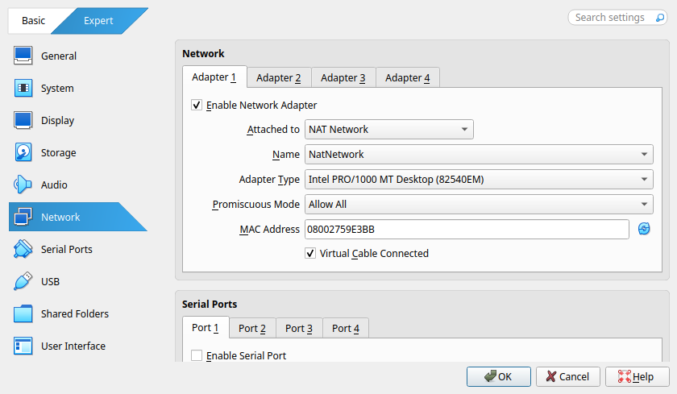
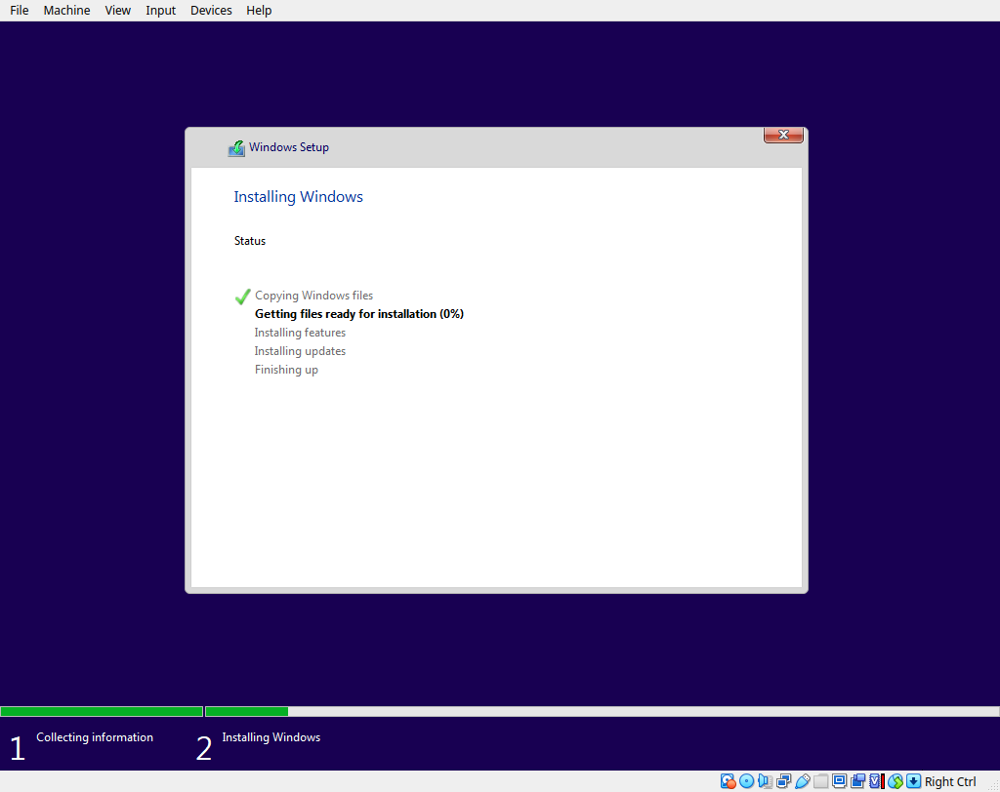
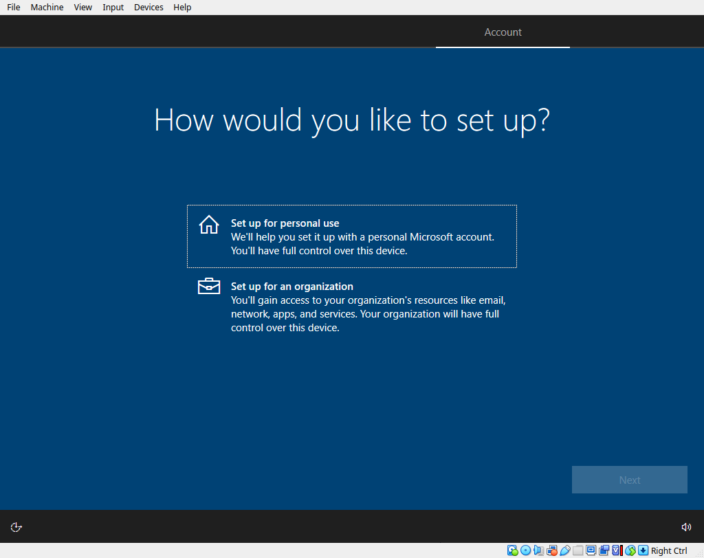
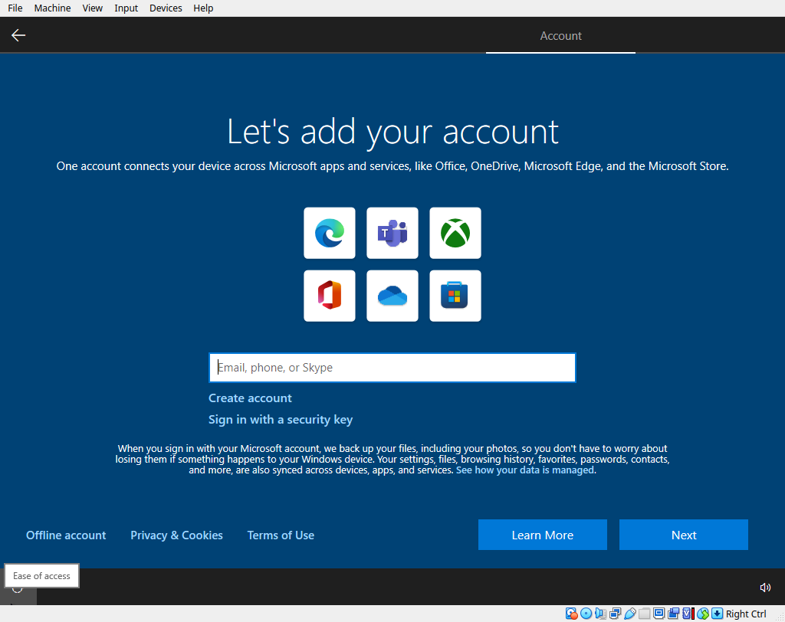
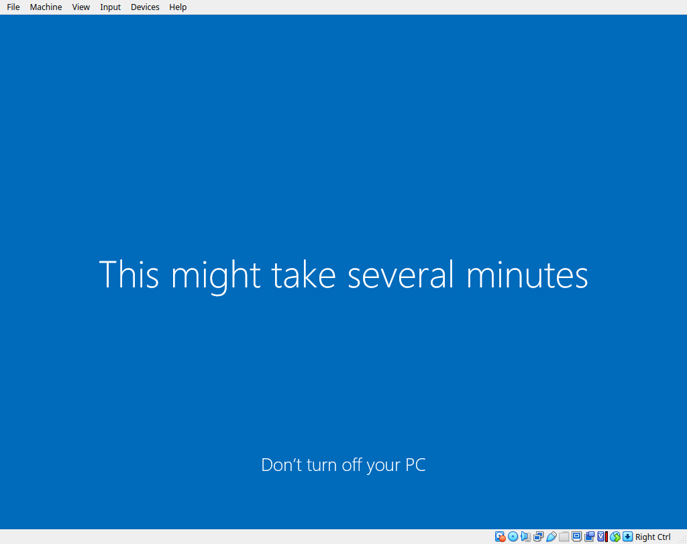

# 🖥️ Windows Client Setup

### **1) Virtual Machine Setup**

- Open **VirtualBox** and click **New**
- Input virtual machine name and select ISO image
- Uncheck **Proceed with Unattended Installation**

- Right click the virtual machine and scroll down to **Network**
- Select **NAT Network** and Allow All

- Start Virtual Machine
- Click **Next** and **Install Now**
- Click **I Don't Have a Product Key**
- Select **Windows 10 Pro** and click **Custom**

- Select **Country** and click **Yes**
- Select **Personal Use**

- Click **Offline Account**

- Click **Limited Experience**
- Create a name and password
- Create 3 security questions and answers
- Continue on until the screen says **Hi**

